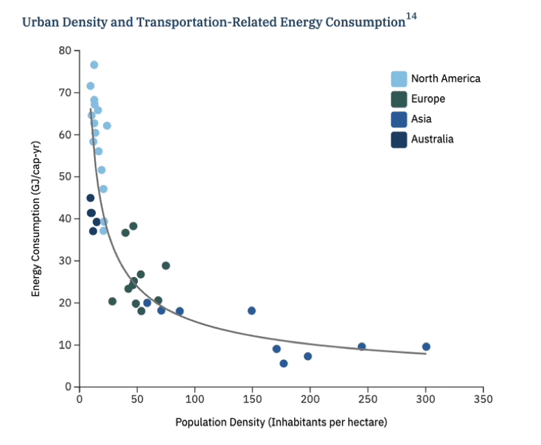
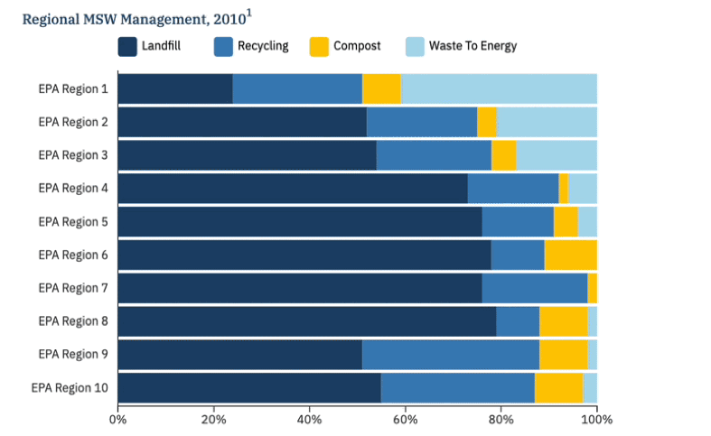
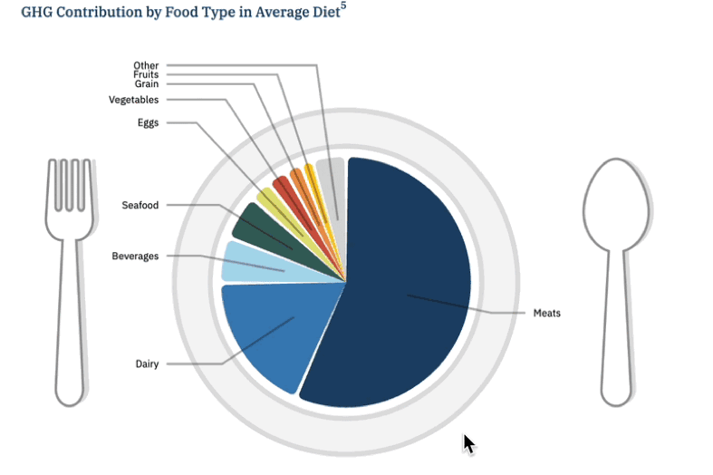
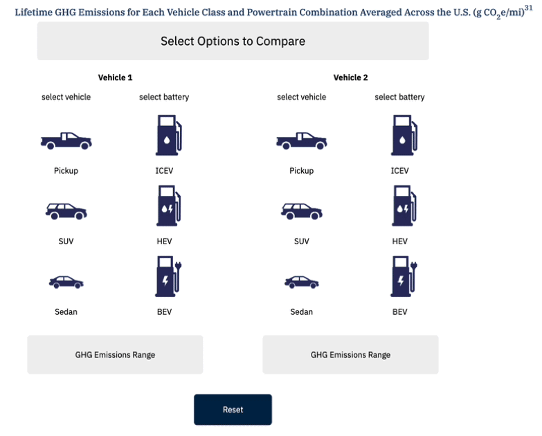

# CSS Data Visualization Internship (Summer 2024)

**Role:** Data Visualization Intern, Center for Sustainable Systems (CSS), University of Michigan  
**Tech:** D3.js, JavaScript (ES6), HTML5/CSS3, CSV data pipelines, Drupal integration, Accessibility (WAVE/aXe)  
**Timeline:** May–Oct 2024  

---

## Overview
During my internship, I built and maintained **100+ interactive D3.js visualizations** for the CSS Sustainability Factsheets. I converted raw data into clean CSVs and reusable chart modules, streamlined update workflows, and improved accessibility and responsiveness across the site.

Key contributions:
- Built reusable **D3 chart components** (line, stacked area, column) with tooltips, legends, and responsive SVG.  
- Created **CSV pipelines** and documented update steps to cut content refresh time by ~40%.  
- Integrated visualizations into the CSS **Drupal site templates**.  
- Validated for **accessibility** (WAVE/aXe) and ensured consistent keyboard/contrast behavior.  

---

## Public Links
- **Live Factsheets site:** [CSS Sustainability Factsheets](https://css.umich.edu/factsheets)  
- **Example pages from the Factsheets site:**  
  - [U.S. Energy System Factsheet](https://css.umich.edu/publications/factsheets/energy/us-energy-system-factsheet)  
  - [Solar PV Energy Factsheet](https://css.umich.edu/publications/factsheets/energy/solar-pv-energy-factsheet)  
  - [U.S. Food System Factsheet](https://css.umich.edu/publications/factsheets/food/us-food-system-factsheet)  
  - [Electric Vehicles Factsheet](https://css.umich.edu/publications/factsheets/mobility/electric-vehicles-factsheet)  
  - [Carbon Footprint Factsheet](https://css.umich.edu/publications/factsheets/sustainability-indicators/carbon-footprint-factsheet)  

---

## Highlights
- Designed charts to be **mobile-first & accessible** (focus states, prefers-reduced-motion support, semantic structure).  
- Encapsulated chart behavior for **reuse across factsheets** (config options, clean data access).  
- Collaborated with researchers to **translate domain data** into clear, accurate visuals.  
- Authored short **how-to docs** so non-dev staff could safely update charts.  

---

## Demo Visualizations

Below are simplified demo GIFs of interactive chart types I worked on.  
(Full interactive versions are available on the [CSS Sustainability Factsheets site](https://css.umich.edu/factsheets).)

| Chart Type | Demo |
|------------|------|
| Line Chart |  |
| Scatter Plot |  |
| Stacked Bar Chart |  |
| Stacked Area Chart |  |
| Interactive Chart |  |
| Interactive Chart |  |
